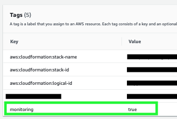

# Lambda Monitoring to Slack Stack

This stack is designed to allow you to monitor your AWS Lambda errors and send alerts to a specified slack channel. There are plenty of paid services (and even some free ones) that offer the same functionality, but the largest drawback is that it requires you to send your logs to a vendor's AWS account. This solution allows you to keep the logs in your account and customize which Lambda's forward their logs to slack.

## Error Types

The current implementation picks up and Lambda Error, Timeout, and any message written with `console.error()`.

## Resources
### Subscriber
The subscriber lambda is invoked any time you update tags on a Lambda function. The subscriber looks for a tag named `monitoring` and looks for that tag value to evaluate to `true`. If the subscriber finds the `monitoring` tag is set to `true` then it creates a new log subscription on the updated lambda. This log subscription subscribes the `Alerter` lambda to the modified lambda's log group.

#### To Do:

 1. Implement unsubscribe logic
 2. Implement error handling

### Alerter
This lambda is invoked by Cloudwatch Logs when a lambda with the `monitoring` tag writes logs. This lambda then parses the log event to find out if it is a function error or a `console.error()`. It then relays this information to a specified slack channel.
#### To Do:

 1. Test timeouts

## Configuring Slack Settings

At this time, this app requires you to specify a Slack Webhook URL. To generate a Slack Webhook URL, follow the `Create The Slack App` portion of [this Medium post](https://medium.com/@cplankey/use-lambda-layers-to-post-to-slack-513782db3d82). Once you have a Webhook URL, you need to add it to the `serverless.yml` file in the `alerter` function's `environment` settings. If your Slack Webhook URL looks like this:
    `https://hooks.slack.com/services/ABCDEF123/12345ABCDEF/XXXXYYYYXXXXYYYYXXXXYYYY`
then update the environment variable to look like this:

    alerter:
	    handler: alerter/index.main
	    environment:
		    SLACK_WEBHOOK_URL: ABCDEF123/12345ABCDEF/XXXXYYYYXXXXYYYYXXXXYYYY

